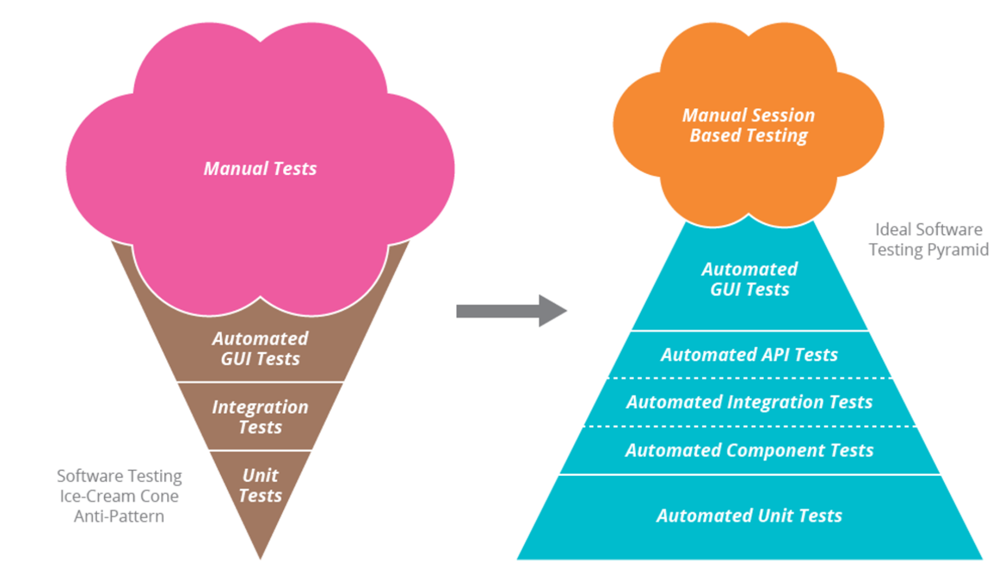
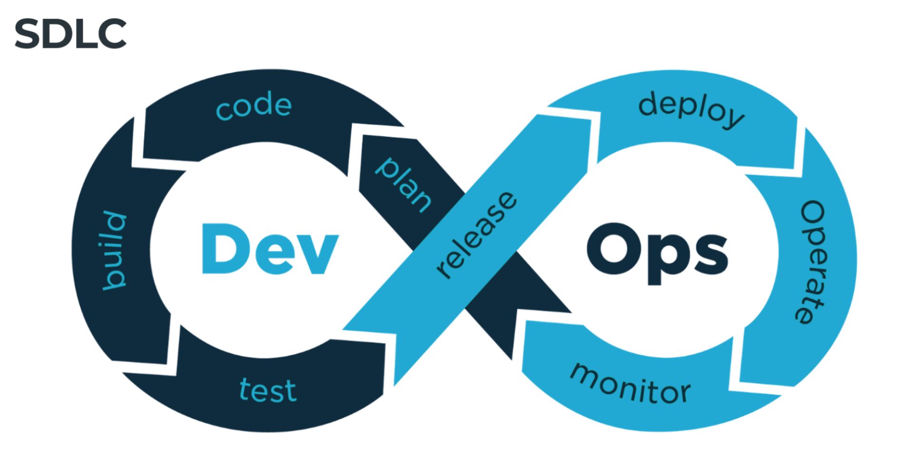
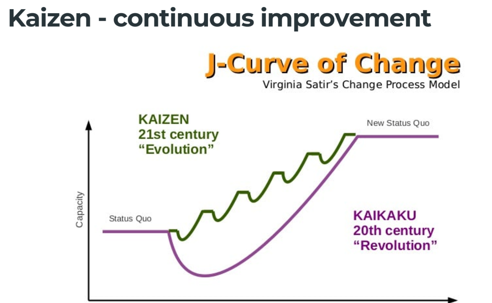
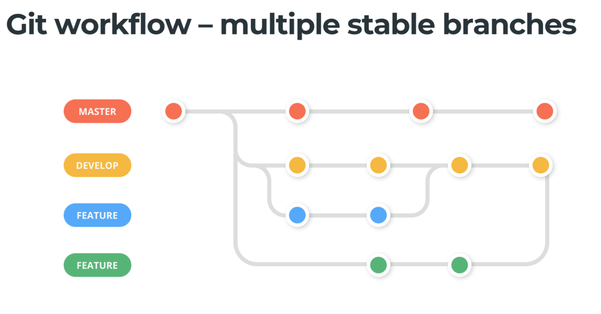
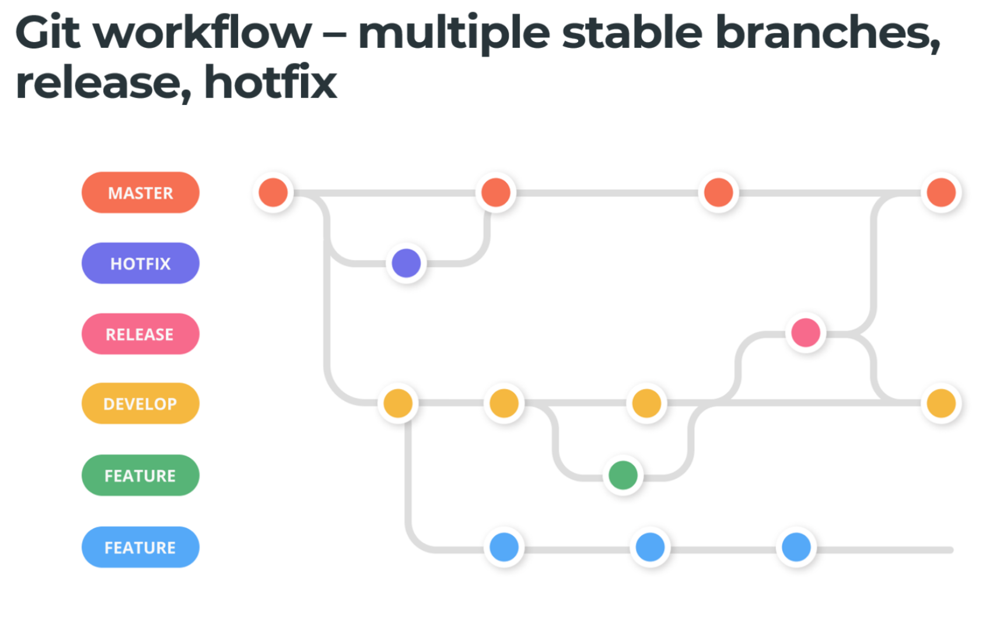
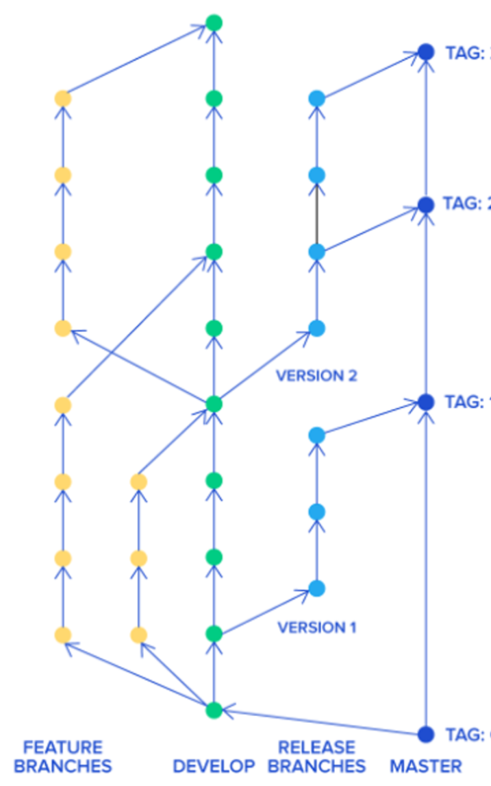
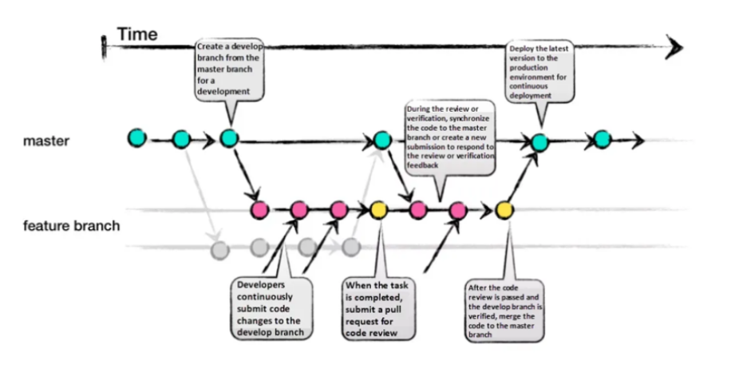
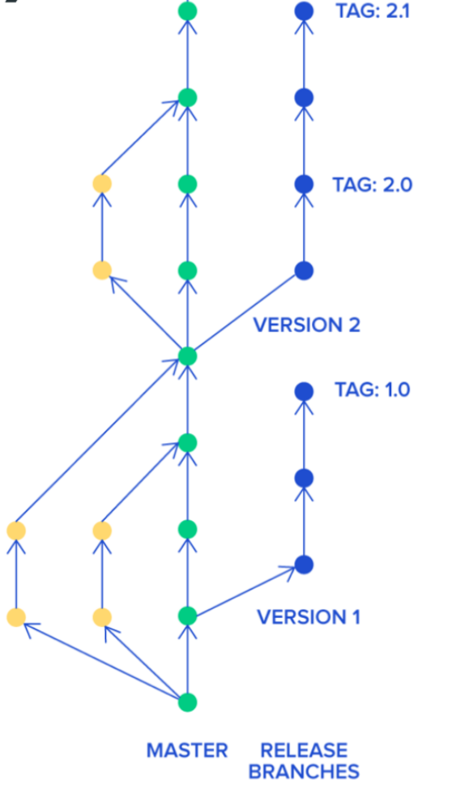

# Theory behind devops practice

## Agile Manifesto

https://agilemanifesto.org/principles.html

## Google DevOps Report

1. Organicational performance
1. Team performance (Culture)

    Westrum’s organizational culture:
        - Pathological (power-oriented) organizations are characterized by large amounts of fear and threat. People often hoard information or withhold it for political reasons, or distort it to make themselves look better.
        - Bureaucratic (rule-oriented) organizations protect departments. Those in the department want to maintain their “turf,” insist on their own rules, and generally do things by the book—their book.
        - Generative (performance-oriented) organizations focus on the mission. How do we accomplish our goal? Everything is subordinated to good performance, to doing what we are supposed to do.

1. Employee well-being

[2023](https://cloud.google.com/blog/products/devops-sre/announcing-the-2023-state-of-devops-report)
[report](https://services.google.com/fh/files/misc/2023_final_report_sodr.pdf)

[2022 report](https://services.google.com/fh/files/misc/2022_state_of_devops_report.pdf)

## SDLC

1. Plan: 
    - Meet with business
    - Find scope and solutions
    - Estimate cost, effort
    - Identity risk, benefits
    - Tools: Jira, Trello, Azure Devops Boards

1. Code 
    - Development begins
    - How we collaborate
    - Peer reviews
    - Tools: Github, Gitlab, Bitbucket, Azure Devops

1. Build 
    - Build the code
    - Dependency management
    - Continuous integration starts (ci)
    - Tools: Local builds, build servers, Jenkins, GHA, Gitlab CI, Bitbucket pipelines, Azure Devops Pipeline

1. Test 
    - Automation testing
    - Manual testing
    - Integration testing
    - performance testing
    - Security testing
    - Tools: Selenium, JMeter, Sonarcloud

1. Release 
    - Prepare build for deployment
    - Bundle dependency

1. Deploy 
    - Deploy the bundle to dev/staging/prod
    - Tools: Local builds, build servers, Jenkins, GHA, Gitlab CI, Bitbucket pipelines, Azure Devops Pipeline

1. Operate 
    - Ongoing maintenance
    - Operational Excellence - backup, cost, uptime, documentation
    - SLA

1. Monitor 
    - Business level metrics
    - Transactions per time interval
    - Which features are used more than others
    - Continuous learning

## Value Stream Mapping

A visual tool that displays all critical steps in a specific process and easily qunatifies the time and volume taken at each stage.

Lead Time: measures the time elapsed between order and delivery (measure arrival time). 
Cycle Time: starts when the actual work begins on the unit and ends when it is ready for delivery (measures completion time).

## Git workflow

### Basic

### Git workflow

### Git flow

It defines specific branch responsibilities (master for prod, decelop - theta,
feature - new features, releases as a gatekeeper to production, hotfixes for
urgent issues)

Pros: 
    - Well-suited for large teams
    - Effective handling of mutltiple product versions
    - clear responsibilies for each branch
    - Allows easy navigation of production versions through tags

Cons: 
    - Complexity due to numerous branches (merge conflicts)
    - Development and release frequency may be slower due to multi-step process
    - Required team consensus and commitment to adhere to the stategy

### Github flow

Improve by eliminate release branches. It resolves around one active branch
(master) for prod. Bugs and features are implemented using long-lived branches.
Common in FOSS projects.

Pros: 
    - Faster feedback cycle and shorter production cycle
    - Ideal for asynchronous work in smaller teams
    - Agile and easier to comprehend compare to git-flow

Cons: 
    - Merging feature branch implies it is production-ready, potentially
      introducing bugs without proper testing and a robust ci/cd process
    - Long-lived branches can complicated the process
    - Challenging to scale for larger teams due to increase merge conflicts
    - Supporting multiple release versions concurrently is difficult

### Trunk-based flow

Single shared branch (trunk/master) and eliminates long-living branches. There are two main variants: 
    - smaller teams commit directly to the trunk
    - larger teams create short-lived feature branches
Frequent integration of smaller feature slices is encouraged to ensure regular merging.

Pros: 
    - Encourages DevOps and unit testing best practices
    - Enhances collaboration and reduces merge conflicts
    - Allows for quick releases

Cons: 
    - Requires an experience team that can slice features appropriately for regular integration
    - Relies on string ci/cd practices to maintain stability.

## Microservices

Six principles of microservices:

- Rely on the public API;
    - define version strategy;
- Use the right tool for the job;
- Secure your services;
- Be good citizen with the ecosystem;
    - Distributed monitoring and tracing
    - Shared metrics
    - Distributed tracing
    - User-experience metrics
- It's more than just technology transformation;
    - two pizza rule
- Automate everything
    - Adopt Continuous delivery

Conway's rule: any organization that designs a system (defined broadly) will
produce a design whose structure is a copy of the organization's communication
structure.

## Additional Resources

- https://www.goodreads.com/list/show/110058.DevOps_must_to_read_list
- https://www.goodreads.com/book/show/23131211-the-practice-of-cloud-system-administration
- https://podcasts.apple.com/us/podcast/devops-cafe-podcast/id371931111
- https://www.infoq.com/engineering-culture-podcast/
- https://www.thoughtworks.com/insights/podcasts
- https://www.goodreads.com/book/show/39677052-ahead-in-the-cloud
- https://www.reddit.com/r/devops/
