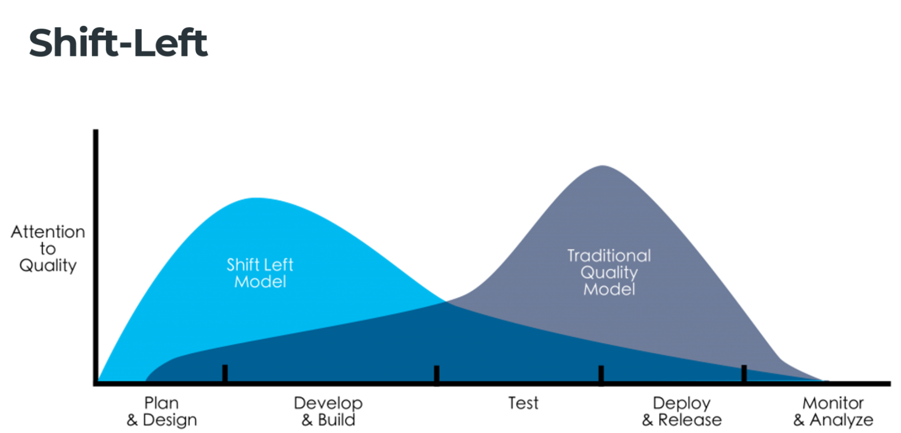
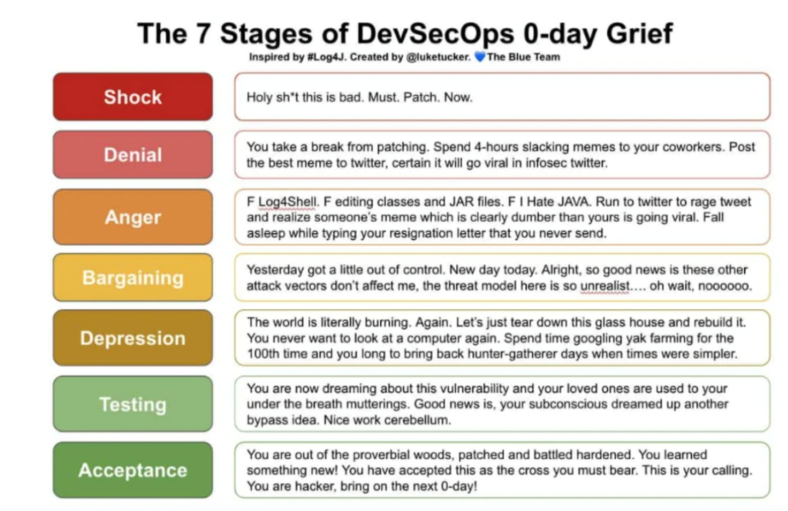

# Security

**DevSecOps**: stands for development, security, and operation, It's an
approach to culture, automation, and platform design that integrates security
as a shared responsiblity throughout the entire IT lifecycle. 
- Application and infrastructure from the start
- Automation security gates
- Selecting the right tool for continues security
- Cultural changes

Custom Code Security: 
- SAST: Static Application Security Testing
  - Tools: sonarqube, veracode, whitesource
- DAST: Dynamic (performed on a running application); black-box testing
  - Tools: synopsys, intruder, sentinel's Dynamic, escape, probely
- IAST: Interactive; gray-box testing
- RASP: Runtime
- SCA: Software Composition analysis
  - track and analyze any OSS and 3rd party components
  - libraries
  - direct and transitive dependencies
  - Tools: SNYK, BlackDuck, retire.js, OWASP dependency track
- Docker Image scanner: Trivy, aqua, clair

**Defense in Depth**: is an information assurance strategy that provides
multiple, redundant defensive measures in case a security control fails or a
vulnerability is exploited. It uses multiple layers of security
controls(defenses) placed throughout an IT system.

OWASP

Golang specific tools (for the time of writting):  
- gosec - static analysis of code (looks for errors like bind to all interfaces, unchecked err)
- govulnchek - static analysis that checks also deps
- trivy - for image scanning
- docker scout - for image scanning
- *optional dependabot
- *optional golangci-lint

## Additional Resources - DevSecOps - shifting security "left" on the pipeline

- https://www.redhat.com/en/topics/devops/what-is-devsecops
- https://simple.wikipedia.org/wiki/Defense_in_depth_(computing)
- https://www.softwaresecured.com/what-do-sast-dast-iast-and-rasp-mean-to-developers/
- https://www.ptsecurity.com/ww-en/analytics/knowledge-base/sast-dast-iast-and-rasp-how-to-choose/
- https://owasp.org/
- https://docs.aws.amazon.com/whitepapers/latest/aws-security-incident-response-guide/

### Practice

https://github.com/vavkamil/awesome-vulnerable-apps

### Books

- https://a.co/d/g4FBEAS
- https://a.co/d/d6I382r
- https://a.co/d/8MVVXws
- https://a.co/d/g1hCvOu
- https://a.co/d/exeH2rP
- https://a.co/d/8LPn9rV
- https://a.co/d/dgZtSNo
- https://a.co/d/czwBbdF

### Useful websites

- https://attack.mitre.org
- https://nvd.nist.gov/vuln-metrics/cvss

### Tools
- https://github.com/future-architect/vuls
- https://trivy.dev
- https://snyk.io
- https://anchore.com/container-vulnerability-scanning/
- https://aws.amazon.com/guardduty/
