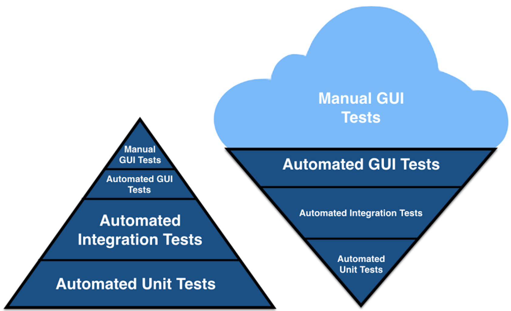
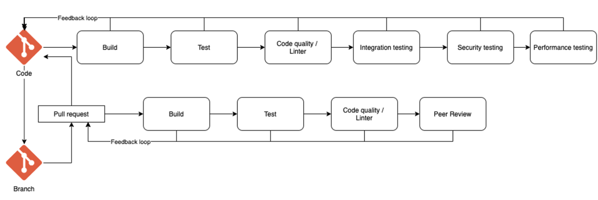
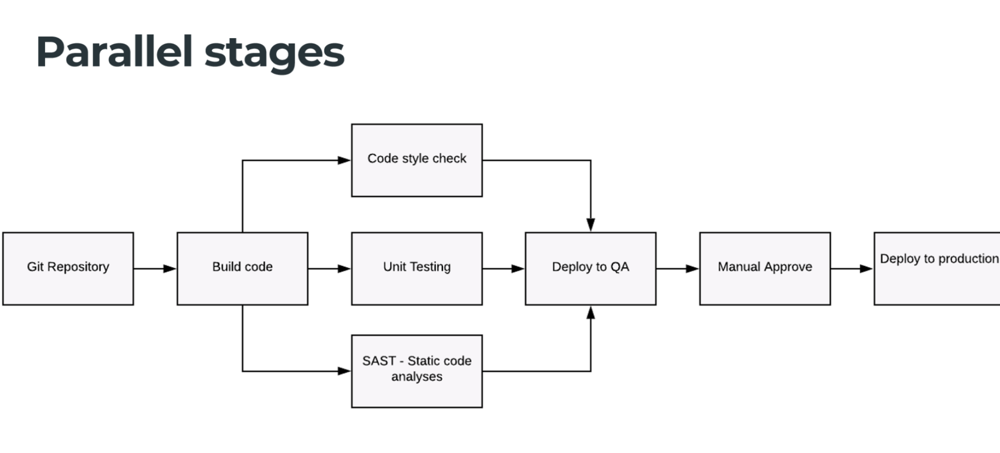
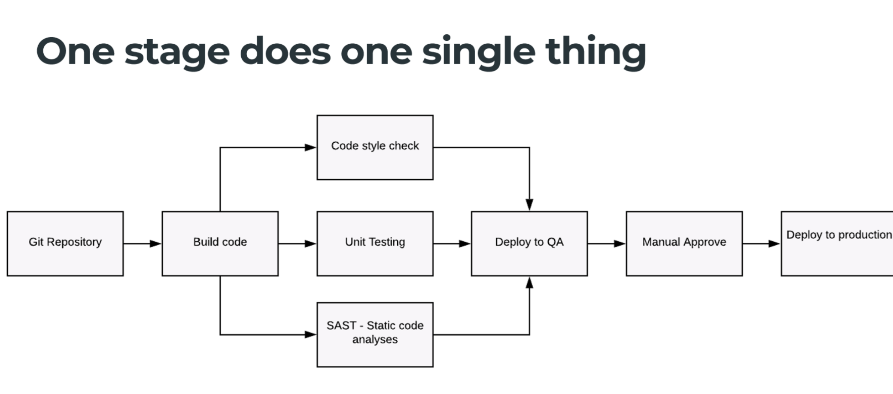
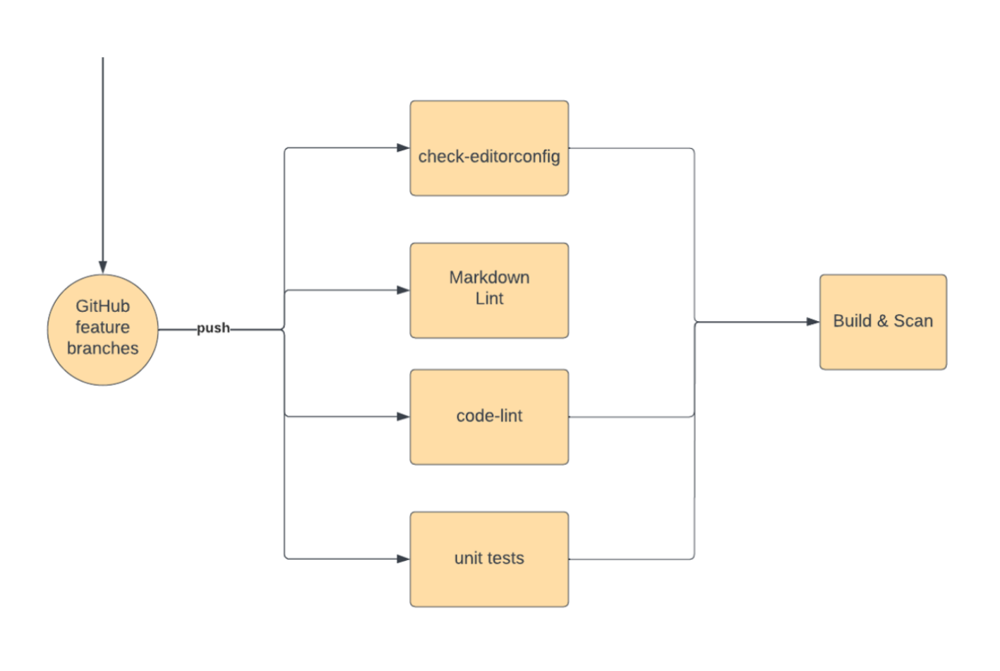
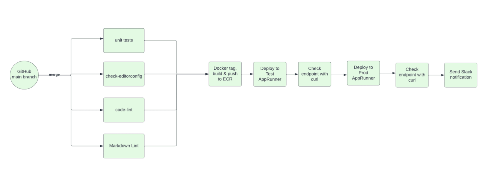

# CI

## Key concepts

### What is it

Software development practice where developers regulary merge their code
changes into central repo, after which automated builds and tests are run. 
- an automation component (ci or build service)
- a cultural component (learning to integrate frequently)

### Goals
- find and address bugs quicker
- improve software quality
- reduce the time it takes to validate and release new software updates

### Practices
- maintain a single source repository
- automated build
- make build self-testing
- every commit should build on an integration machine
- keep the build fast
- test in a clone of the production environment
- make it easy for anyone get the latest executable version
- automate deployment

### Benefits
- CI enables organizations to scale in engineering team size
- improve the feedback loop
- Enhance communication
- Team Adoption and initial technical installation
- Technology learning curve

### Environments
- dev (demo scenes)
  - one cluster with no limitations (easy to deployment and testing), deploy from dedicated branch
  - same as above but deploy from feature branch
- staging (prod-like env)
- prod

## CI

Code -> Build -> Test -> Deploy
CI: Build+Test

If in doubt - use one vendor:
- github + github actions + github packages
- gitlab + gitlab ci + gitlab artefacts

### Testing practices
- Software build
- Unit testing
- Code quality
- Integration testing
- Security testing
- Performance testing
- UI testing
- Accessibility testing
- Test the infra with the code
- Data migration

Code quality and linting

* Note^: smoke, sanity and synthetic testing are usually
  done by dev (dedicated like qa or not)

* Note^^: Tests base on context: analyze the dependency
  tree and run those tests that are around those
  dependencies, not whole suite.

#### TDD

- This is more about desing than actual testing
- Error detection protocol

## Pipeline

We use pipelines to organise all steps required to go
from idea to releasable software and we automate as
much dev processes as we can to ensure that we produce
software repeatably and reliably.

From commit -> releasable outcome (asset)

### Key practices

- version control
  - same repo as the code
  - audit trail
  - knowledge sharing
  - reusability
- automation
- testing
- working efficiently - achieve short lead time and fast feedback

Lead time: how long it takes for new code to complete
its transit through the deployment pipeline.

Continous delivery/deployment: 
- delivery: all until deployment (approve deploy; like in prod);
- deployment: all until end (like in dev and staging);

https://www.thoughtworks.com/radar

### Components

- Commit stage
- Artifact repository
- Acceptance stage
- Ability to deploy to prod

### Build Management Systems

- GHA
- Azure DevOps Pipelines
- Bitbucket pipelines
- Gitlab CI
- Jenkins
- CircleCI

#### Criteria

- pipeline as code
- reusable modules
- scheduled pipelines
- chat integration
- multiple approvals enforcing
- pipeline secururity & compliance
- parallel jobs
- upstream trigger
  - to trigger upstream service pipeline when downstream service get new change
- internal variables & secrets store
- hashicorp Vault integration
- external source control providers
- data residency
  - where is hosted the repo (important for institutions)
- user management - SSO/AD
- SLA
  - does it have
  - what happened when they break SLA
- self-hosted runners
  - autoscalling
- Managed Linux/Windows/Mac os

> Lock-in cost = Migration Cost - Opportunity Gain

- Lock-in cost - how much does it cost to use one/this vendor only
- Migration cost - how much does it cost to change it
- Opportunity Gain - what does we gain/win from using this vendor

## Github Actions Components
- Workflows
  - more or less one pipeline
- Events
  - how we trigger one workflow
- Jobs
  - more like stage
  - it may have multiple steps
- Steps
  - least granular steps (e.g. checkout code; install deps; run unit tests)
- Actions
  - predefined ready-to-use actions (like one for trivy or editorconfig)
- Runners
  - where does our code works
