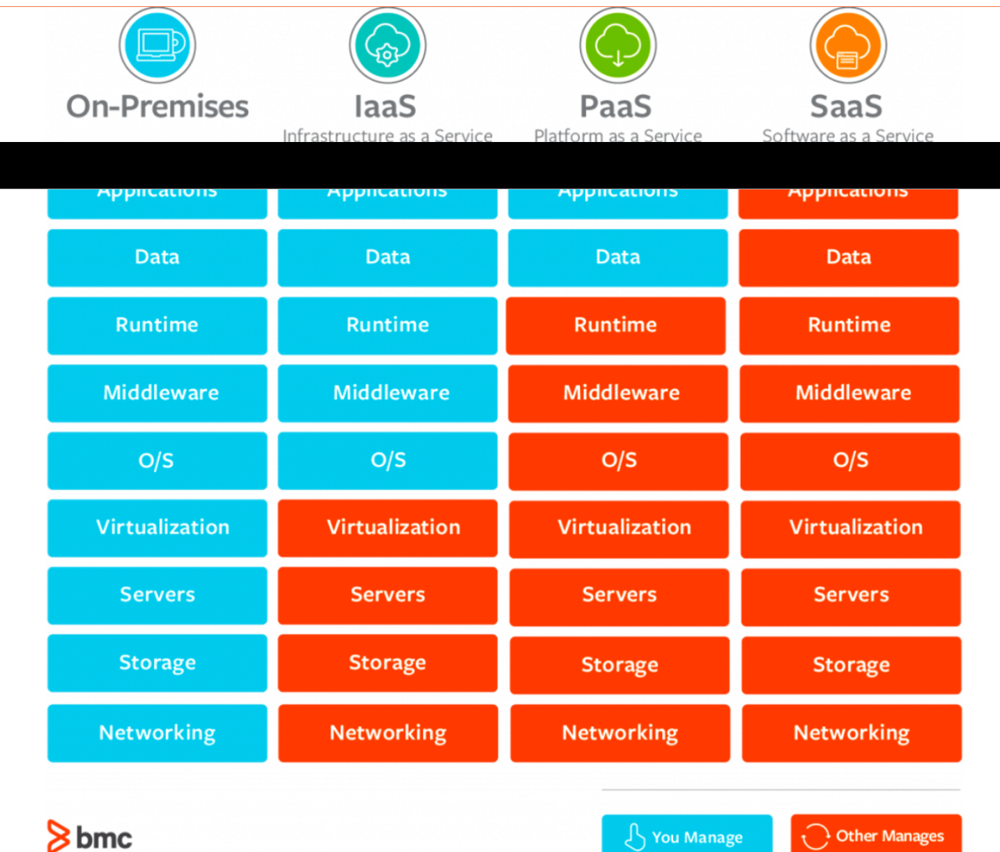

# Public Cloud

## Definition
It gives **programmable resources** that are available (loan). They are
**dynamic abilities** (can scale as you go) and you may pay as you go.

### Pros

- Trade capital expense for variable expense (no need to buy hardware)
  - pay as you consume resources
  - pay only for what you consume
- Benefit from massive economies of scale
  - benefit of massive data centers
- Stop guessing capacity (and develop faster)
  - scale up/down as required
  - no need to overprovision
- Increase speed and agility
  - experiment and develop faster
- Added value
  - focus on work that adds value
- Go global in minutes
  - multiple aws regions around the world
  - lower latence and a better experience for you customer
  - achieve high availability and disaster recovery

### Cons

- Where the client need/want on-premise solution
  - institutions, goverments, airlines
- Kind of expensive
  - what is total cost of ownership
- Not every business scales that much to benefit of autoscaling of the cloud

## Types

- Cloud
- Hybrid
- On-premises

### IaaS (Infrastructure as a Service)
- virtual machines on loan

### PaaS (Platform as a Service)
- VM, apache, tomcat, java are preinstalled

### SaaS (Service as a Service)
- gmail, image recognition

## AWS CAF
- Business Perspective (it finance, it strategy, benefits realization, busness risk management)
- People perspective (resource management, incentive management, career management, training management, organization change management)
- Governance Perspective (portoflio management, program and project management, business performance measurment, license management)
- Platform Perspective (compute, network, storage, database provisioning, systems and solution architecture, application development)
- Security Perspective (identity access manangement, detective control, infra security, data protection, incident response)
- Operation Perspective (service monitoring, app performance monitoring, resource inventory management, release management, reporting and analytics, disaster recovery, it service catalog)
